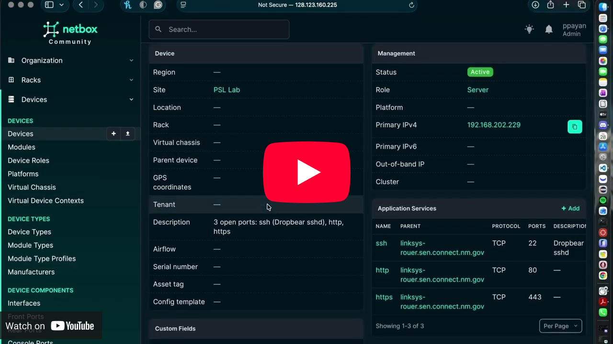
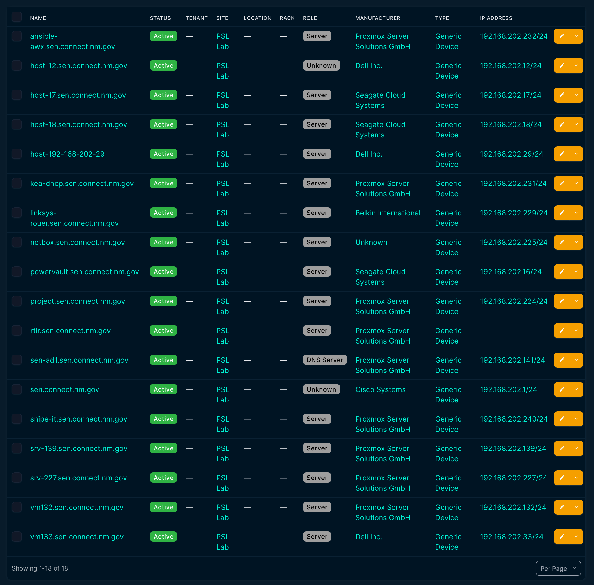
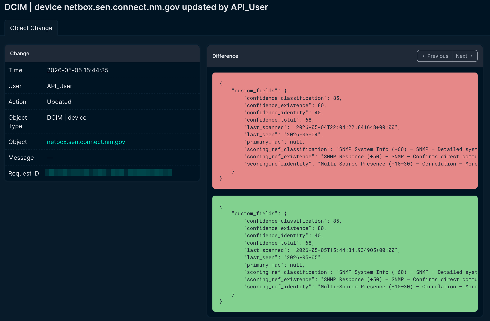
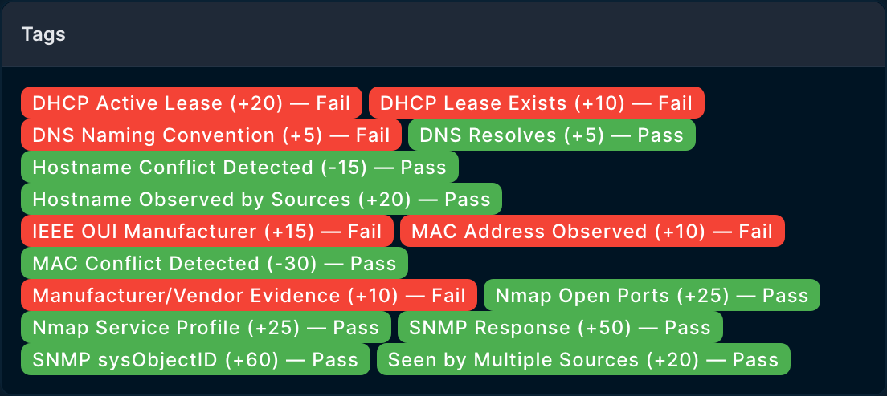

# Automation Station

Automated Network Discovery and NetBox Integration with Confidence-Based
Validation

(this project was made in a sandbox environment and has no affiliation with Sen.connect.nm.gov or any other etities.)

------------------------------------------------------------------------

## Overview

Automation Station is an automated network discovery and validation
system designed to enhance NetBox by adding intelligent,
confidence-based device auto-discovery.

The system combines multiple discovery methods, logs all scan evidence
into a structured database, applies a weighted confidence scoring model,
and synchronizes all discovered devices into NetBox with validation
transparency.

[](https://www.youtube.com/watch?v=mwSHJNeIb-M)

------------------------------------------------------------------------

## Core Features

### Multi-Method Device Discovery

-   Nmap active scanning (host discovery + service detection)
-   SNMP queries (sysName, sysDescr, uptime, interfaces)
-   DHCP lease correlation via Kea REST API
-   DNS forward and reverse resolution
-   IEEE OUI manufacturer lookup from MAC addresses

### Centralized Database Logging

-   Persistent scan history
-   Time-based validation
-   Conflict detection
-   Re-scoring without re-scanning
-   Full audit trail of scoring decisions

### Confidence-Based Scoring

-   Weighted scoring model across three categories: Existence, Identity,
    Classification
-   Configurable confidence threshold
-   Transparent validation logic
-   False positive reduction
-   Email reporting for low-confidence devices

### Automated NetBox Integration

-   Device creation via API with auto-created prerequisites (sites,
    manufacturers, device roles, device types)
-   IP address assignment with primary IPv4 designation
-   Duplicate detection
-   Update handling
-   Validation status tagging
-   Custom fields for confidence scores and scoring rubric reference
-   Color-coded pass/fail tags per check
-   Last-scanned timestamps on every device

### Populated Device List



------------------------------------------------------------------------

## Quick Start

### For non-technical users

Double-click the desktop shortcut, or run from terminal:

``` bash
automation-station-launch
```

The launcher detects an existing `.env` config and runs immediately, or
walks you through an interactive setup if no config is found. Designed
for users who don't want to touch the command line.

### For developers and sysadmins

``` bash
automation-station             # run the pipeline (requires existing .env)
automation-station-launch      # friendly launcher with config detection
automation-station-cleanup     # delete all pipeline-created NetBox objects
automation-station-test        # validate NetBox API connectivity
```

------------------------------------------------------------------------

## System Architecture

1.  Discovery Layer\
    Devices are scanned using Nmap and enriched with SNMP and DNS/DHCP
    data, plus IEEE OUI manufacturer lookup from MAC addresses.

2.  Database Logging Layer\
    All raw discovery evidence is stored in a centralized SQLite
    database for re-scoring and audit purposes.

3.  Correlation & Validation\
    Data is normalized and matched by IP, MAC address, and hostname
    across all discovery sources.

4.  Confidence Scoring\
    A weighted scoring engine evaluates validation strength across
    Existence, Identity, and Classification categories.

5.  NetBox Synchronization\
    All discovered devices are created in NetBox with validation
    metadata, pass/fail tags, confidence scores, and scan timestamps.

------------------------------------------------------------------------

## Decision Logic

All discovered devices are added to NetBox.

The confidence score determines device validation status, not whether
the device is created.

-   Score ≥ Threshold → Device marked as **Validated**
-   Score \< Threshold → Device marked as **Unverified** and flagged
    with validation details

Devices below the confidence threshold will:

-   Still be created in NetBox
-   Include confidence score metadata
-   Include flags showing which validation checks passed or failed
-   Be marked for administrative review
-   Trigger an email alert if score is below `MAIL_REPORT_THRESHOLD`

This ensures full inventory visibility while maintaining transparency
about device reliability.
Changes in confidence scores for a device will appear in its changelogs to help record a device's reliability evolving over past iterations.


------------------------------------------------------------------------

## Database Architecture

### Devices Table

-   device_id (Primary Key)
-   ip_address
-   mac_address
-   hostname
-   first_seen
-   last_seen
-   current_confidence_score
-   classification_status

### Scan_Results Table

-   scan_id (Primary Key)
-   device_id (Foreign Key)
-   source (nmap / snmp / dns / dhcp)
-   raw_data (JSON)
-   timestamp

### Confidence_History Table

-   device_id
-   score
-   timestamp
-   decision (validated / unverified)

------------------------------------------------------------------------

## NetBox Custom Fields and Tags

Every device pushed to NetBox is enriched with the following metadata,
all auto-created on first run:

### Custom Fields

-   `confidence_existence` — Existence score (0–100)
-   `confidence_identity` — Identity score (0–100)
-   `confidence_classification` — Classification score (0–100)
-   `confidence_total` — Overall combined score (0–100)
-   `last_seen` — Date of most recent scan
-   `last_scanned` — Full UTC timestamp of most recent scan
-   `primary_mac` — MAC address as observed during discovery
-   `scoring_ref_existence` — Reference text explaining existence
    scoring weights
-   `scoring_ref_identity` — Reference text explaining identity scoring
    weights
-   `scoring_ref_classification` — Reference text explaining
    classification scoring weights

### Tags

For every check performed during scoring, a color-coded pass/fail tag is
applied to the device:

-   Green tags = check passed
-   Red tags = check failed
-   Tag names include the check label, weight contribution, and result

This allows operators to see at a glance which evidence sources backed a
device's score.



------------------------------------------------------------------------

## Technologies Used

-   Python 3.10+
-   nmap (system binary)
-   pysnmp
-   python-dotenv
-   requests
-   rich
-   SQLite (via Python stdlib `sqlite3`)
-   NetBox 4.x REST API
-   Kea DHCP REST API

------------------------------------------------------------------------

## Installation

### Clone Repository

``` bash
git clone https://github.com/bbb83/AutomationStation.git
cd AutomationStation
```

### Install nmap

``` bash
sudo apt install nmap                                                  # Debian/Ubuntu
sudo setcap cap_net_raw,cap_net_admin,cap_net_bind_service+eip $(which nmap)
```

The `setcap` command grants nmap the network capabilities it needs to
perform SYN scans without requiring root privileges. This means
Automation Station can run as an unprivileged user.

### Install the package

``` bash
pip install -e .
```

This installs all Python dependencies from `pyproject.toml` and
registers four console commands: `automation-station`,
`automation-station-launch`, `automation-station-cleanup`, and
`automation-station-test`.

The `-e` (editable) flag means code changes take effect immediately
without reinstalling.

### Configure Environment Variables (.env)

The launcher will create this for you interactively if you run
`automation-station-launch` with no config present. Otherwise, create a
`.env` file in the project directory with the following:

    # ─── Kea DHCP REST API ─────────────────
    KEA_API_URL=http:/your-kea-url:port
    KEA_API_USERNAME=your-kea-username
    KEA_API_PASSWORD=your-kea-password
    KEA_COMMAND=lease4-get-all
    KEA_SERVICE=dhcp4

    # ─── SNMP ──────────────────────────────
    SNMP_COMMUNITY=your_community_name
    SNMP_VERSION=2c # 2c or v1
    SNMP_TARGET_SUBNET=192.168.1.0/24

    # SNMP OIDs
    SNMP_OID_HOSTNAME=1.3.6.1.2.1.1.5.0
    SNMP_OID_DESCRIPTION=1.3.6.1.2.1.1.1.0
    SNMP_OID_UPTIME=1.3.6.1.2.1.1.3.0
    SNMP_OID_INTERFACES=1.3.6.1.2.1.2.2.1.2

    # ─── DNS ───────────────────────────────
    DNS_SERVER=192.168.1.0
    DNS_DOMAIN=your.domain

    # ─── NetBox ────────────────────────────
    NETBOX_URL=http://your-netbox-url
    NETBOX_TOKEN=your-netbox-token

    # ─── Network ───────────────────────────
    SUBNET=192.168.1.0/24
    DHCP_POOL_START=192.168.1.1
    DHCP_POOL_END=192.168.1.254

    # ─── Confidence Scoring ────────────────
    CONFIDENCE_THRESHOLD=75
    SCORE_THRESHOLD=0.5

    # ─── Database ───────────────────────────
    DATABASE_URL=sqlite:///automation_station.db

    # ─── SMTP ───────────────────────────────
    SMTP_HOST=your.smtp.server
    SMTP_PORT=587
    SMTP_USER=smtp-service-username/key
    SMTP_PASS=smtp-service-password/token
    MAIL_FROM=sender.email@domain
    MAIL_TO=receiever.email.1@domain, receiever.email.2@domain
    MAIL_REPORT_THRESHOLD=40

### Configuration Search Path

The launcher looks for a config file in this order, first match wins:

1.  `.env` in the current directory
2.  `~/.config/automation-station/config.env`
3.  `/etc/automation-station/config.env`

This makes it easy to support local development (`.env` in the project
folder), per-user installs (`~/.config/`), and system-wide deployments
(`/etc/`).

### Initialize Database

The SQLite databases are initialized automatically on first run. No
separate setup step is required.

### Run Application

``` bash
automation-station-launch
```

Or for direct invocation without the launcher's setup wizard:

``` bash
automation-station
```

------------------------------------------------------------------------

## Desktop Shortcut (Linux)

A `.desktop` file is included for double-click launching from a
graphical desktop environment. Copy it to your desktop and mark it
executable:

``` bash
chmod +x automation-station.desktop
cp automation-station.desktop ~/Desktop/
```

------------------------------------------------------------------------

## Evaluation Metrics

-   Detection accuracy
-   False positive rate
-   False negative rate
-   Classification accuracy
-   Confidence score stability
-   API synchronization reliability

------------------------------------------------------------------------

## Intended Users

-   Network Engineers
-   IT Operations Teams
-   SOC Analysts
-   Cybersecurity Teams

------------------------------------------------------------------------

## License

Intended for academic and research use.    Devices are scanned using Nmap and enriched with SNMP and DNS/DHCP
    data.

2.  Database Logging Layer\
    All raw discovery evidence is stored in a centralized database.

3.  Correlation & Validation\
    Data is normalized and matched by IP, MAC address, and hostname.

4.  Confidence Scoring\
    A weighted scoring engine evaluates validation strength.

5.  NetBox Synchronization\
    All discovered devices are created in NetBox with validation
    metadata.

------------------------------------------------------------------------
